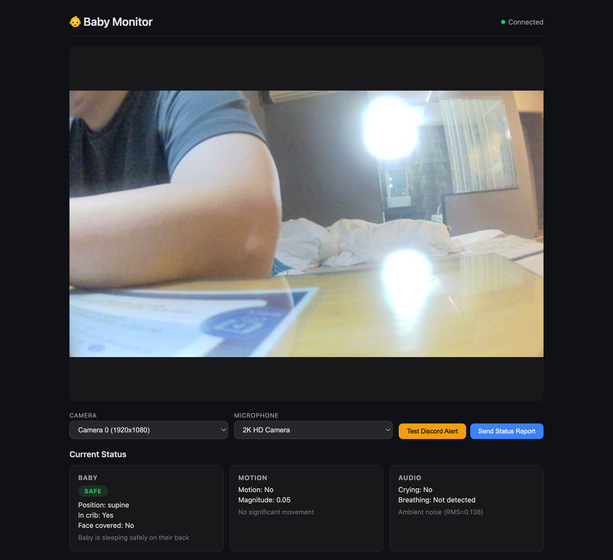

# Baby Safety Cam AI

AI 기반 실시간 아기 모니터링 시스템입니다. 비전 AI와 오디오 분석을 활용하여 아기의 안전을 24시간 감시하고, 위험 상황 발생 시 Discord로 즉각적인 알림을 보내드립니다.


## 주요 기능

### 비전 AI 분석 (Ollama Qwen3-VL)
- 아기 자세 분석 (바로 누움/엎드림/옆으로 누움)
- 얼굴 가림 감지 (이불, 베개 등)
- 침대 이탈 감지
- 위험도 자동 평가 (안전/주의/위험)

### 움직임 감지 (Optical Flow)
- Lucas-Kanade 알고리즘 기반 실시간 움직임 추적
- 움직임 강도 및 패턴 분석
- 15 FPS 고속 분석

### 오디오 분석 (Librosa)
- 아기 울음 감지 (스펙트럼 분석)
- 호흡 패턴 감지 (자기상관 분석)
- 실시간 WebSocket 오디오 스트리밍

### Discord 알림 시스템
- **경고 채널**: 위험 상황 즉시 알림 + 캡처 사진
- **상태 채널**: 5분마다 요약 보고서


## 기술 스택

| 분류 | 기술 |
|------|------|
| Backend | Python 3.11, Flask, Flask-SocketIO |
| AI Vision | Ollama, Qwen3-VL |
| Computer Vision | OpenCV (Optical Flow) |
| Audio | Librosa, SoundDevice |
| Database | SQLite (WAL mode) |
| Notification | Discord Webhook |
| Package Manager | uv |

## 시스템 요구사항

- macOS / Linux / Windows
- Python 3.11+
- Ollama 설치 필요
- 웹캠 및 마이크
- 16GB+ RAM 권장 (AI 모델용)

## 설치 방법

### 1. 프로젝트 클론

```bash
git clone https://github.com/malacca-whale/baby-safety-cam-ai.git
cd baby-safety-cam-ai
```

### 2. uv 설치 (패키지 매니저)

```bash
curl -LsSf https://astral.sh/uv/install.sh | sh
```

### 3. 의존성 설치

```bash
uv sync
```

### 4. Ollama 설치 및 모델 다운로드

```bash
# macOS
brew install ollama

# Qwen3-VL 모델 다운로드
ollama pull qwen3-vl:latest
```

### 5. 환경 변수 설정

```bash
cp .env.example .env
```

`.env` 파일 수정:

```env
# Ollama
OLLAMA_URL=http://localhost:11434
OLLAMA_MODEL=qwen3-vl:latest

# Discord Webhooks
DISCORD_WARNING_WEBHOOK=https://discord.com/api/webhooks/YOUR_WARNING_WEBHOOK
DISCORD_STATUS_WEBHOOK=https://discord.com/api/webhooks/YOUR_STATUS_WEBHOOK

# 디바이스 설정
CAMERA_ID=0
MICROPHONE_ID=0
```

### 6. 실행

```bash
uv run python -m src.main
```

브라우저에서 http://localhost:8080 접속

## 외부 접속 (Cloudflare Tunnel)

외부에서 HTTPS로 안전하게 접속할 수 있는 고정 URL을 무료로 생성합니다.

### 사전 요구사항

| 항목 | 요구사항 |
|------|----------|
| **Cloudflare 계정** | 무료 계정 (신용카드 불필요) |
| **cloudflared** | Cloudflare Tunnel CLI 도구 |

### 1. Cloudflare 계정 생성 (최초 1회)

1. [dash.cloudflare.com/sign-up](https://dash.cloudflare.com/sign-up) 접속
2. 이메일과 비밀번호로 가입 (무료)
3. 이메일 인증 완료

> 💡 **무료 플랜**으로 충분합니다. 도메인 등록이나 신용카드가 필요하지 않습니다.

### 2. cloudflared 설치

```bash
# macOS
brew install cloudflared

# Linux (Debian/Ubuntu)
curl -L --output cloudflared.deb https://github.com/cloudflare/cloudflared/releases/latest/download/cloudflared-linux-amd64.deb
sudo dpkg -i cloudflared.deb

# 설치 확인
cloudflared --version
```

### 3. 터널 설정 (최초 1회)

```bash
./scripts/setup-tunnel.sh
```

실행하면:
1. 브라우저가 열림 → Cloudflare 로그인
2. 터널 `baby-cam-{hash}` 자동 생성
3. 설정 파일 `~/.cloudflared/config.yml` 생성

### 4. 터널 실행

```bash
# 터미널 1: 서버 실행
uv run python -m src.main

# 터미널 2: 터널 실행
./scripts/run-tunnel.sh
```

### 외부 접속 URL

```
https://baby-cam-e9a2888148d3.cfargotunnel.com
```

### 참고 사항

| 항목 | 설명 |
|------|------|
| **URL 유지** | 터널 이름이 같으면 URL 영구 유지 |
| **접속 조건** | `cloudflared`가 실행 중일 때만 외부 접속 가능 |
| **보안** | Cloudflare가 HTTPS 자동 제공 (인증서 관리 불필요) |
| **비용** | 완전 무료 (Cloudflare Zero Trust 무료 티어) |

### 수동 설정 (선택사항)

스크립트 대신 직접 설정하려면:

```bash
# 1. Cloudflare 로그인
cloudflared tunnel login

# 2. 터널 생성 (이름은 원하는대로)
cloudflared tunnel create my-baby-cam

# 3. 설정 파일 생성 (~/.cloudflared/config.yml)
cat > ~/.cloudflared/config.yml << EOF
tunnel: <TUNNEL_ID>
credentials-file: ~/.cloudflared/<TUNNEL_ID>.json
ingress:
  - hostname: my-baby-cam.cfargotunnel.com
    service: http://localhost:8080
  - service: http_status:404
EOF

# 4. 터널 실행
cloudflared tunnel run my-baby-cam
```

## 웹 UI 기능

- **실시간 비디오 스트리밍**: MJPEG 방식의 저지연 영상
- **오디오 모니터링**: 실시간 소리 청취 및 레벨 미터
- **상태 대시보드**: 아기/움직임/오디오 실시간 상태
- **통계**: 분석 횟수, 알림 횟수, 울음 감지 횟수
- **히스토리**: Discord 로그, 영상 분석, 이벤트 기록



## 프로젝트 구조

```
baby-safety-cam-ai/
├── src/
│   ├── main.py           # Flask 앱 + API 엔드포인트
│   ├── vision/
│   │   ├── analyzer.py   # Ollama VQA 분석
│   │   ├── motion.py     # Optical Flow 움직임 감지
│   │   └── schemas.py    # Pydantic 스키마
│   ├── audio/
│   │   └── analyzer.py   # 오디오 분석 + 스트리밍
│   ├── alert/
│   │   ├── discord.py    # Discord 웹훅
│   │   └── manager.py    # 알림 로직
│   ├── streaming/
│   │   └── camera.py     # 카메라 캡처 + MJPEG
│   ├── pipeline/
│   │   └── processor.py  # 메인 처리 파이프라인
│   ├── db/
│   │   └── database.py   # SQLite 데이터베이스
│   └── utils/
│       └── config.py     # 환경 설정
├── templates/
│   └── index.html        # 웹 UI
├── static/
│   ├── css/
│   └── js/
└── docs/                 # GitHub Pages
```

## API 엔드포인트

| 엔드포인트 | 메서드 | 설명 |
|------------|--------|------|
| `/` | GET | 웹 UI |
| `/video_feed` | GET | MJPEG 비디오 스트림 |
| `/api/stats` | GET | 통계 정보 |
| `/api/test_alert` | POST | 테스트 알림 전송 |
| `/api/force_report` | POST | 즉시 상태 보고 |
| `/api/history/discord` | GET | Discord 로그 |
| `/api/history/vision` | GET | 영상 분석 로그 |
| `/api/history/events` | GET | 이벤트 로그 |

## 라이선스

MIT License

## 만든 이

- [@malacca-whale](https://github.com/malacca-whale)

---

**주의**: 이 시스템은 보조 모니터링 도구입니다. 아기의 안전을 위해 항상 직접 확인하시기 바랍니다.
